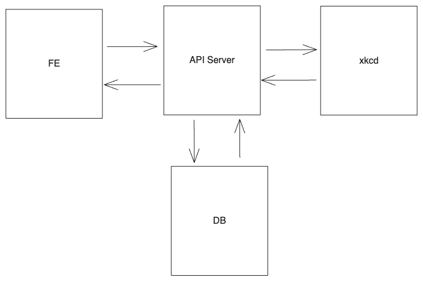

# xkcd Web App

A small web application wrapping the XKCD API.



A diagram of the web app ecosystem.

## Server

The server is built in Node.js using Express.

The server serves the front end for any route that is hit.

There are three API routes:
 - `/api/` Pulls the current day's image from the xkcd API and updates the view count of the associated record in the database.
 - `/api/maxnumber` Pulls the current day's image from the xkcd API and returns it's number.
 - `/api/:number` Pulls the xkcd API URL `https://xkcd.com/:number/info.0.json` and updates the view count of the associated record in the database.

### Note:
The server is hosted on [Render](render.com) using the free tier. On the free tier, the service is spun down after a period of inactivity; it may take a minute to spin up when it becomes active again.

## Front end

The front end is built in React.

React router is used to make calls to the server `/api` routes. With the exception of `/maxnumber`, the paths on the front end match the paths in the `/api` route on the server. For example, if the front end is on the root `/`, then a call is made to the `/api/` on the server; if the front end is on a path matching `/:number`, then a call is made to `/api/:number` the server using the `number` parameter.

The front end calls the route `/api/maxnumber` when it mounts to get the maximum page number for indexing the pages. The maximum page number is distributed with a context.

## Database

The database is MongoDB. The database stores records in the form:
```
{
  comicNum: Number,
  viewCount: Number
}
```